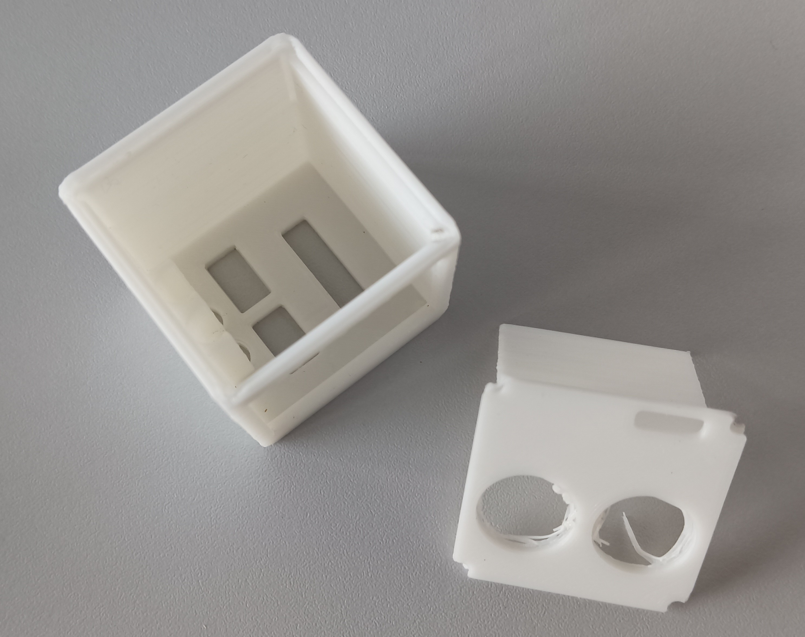
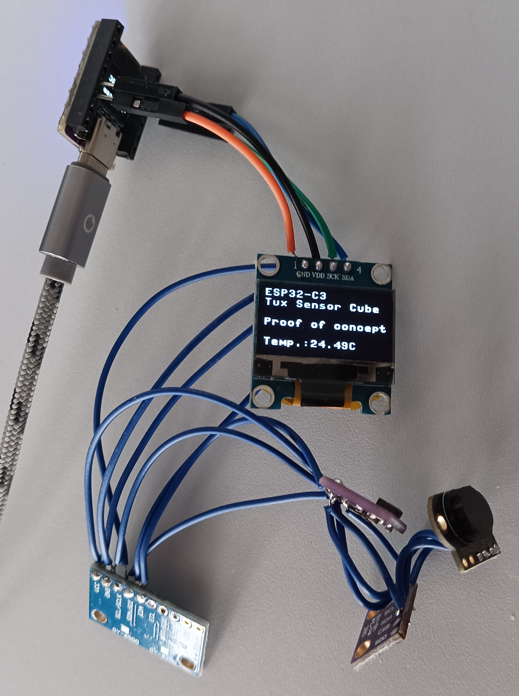
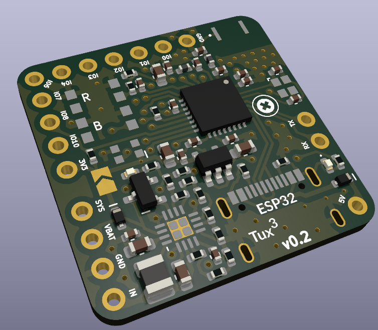
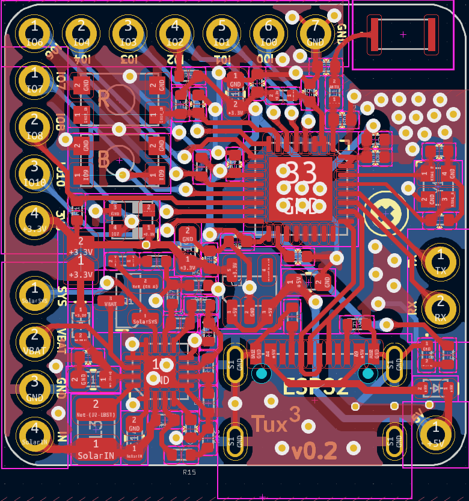

# Physics Sensor Cube ESP32-Tux³

15.04.23 Idea for own ESP32 PCB Design  
16.04.23 Idea for physics sensor cube Tux³ and first sketches  
17.04.23 Design and order of v0.1 PCB  
22.04.23 First prototype and proof of concept  
23.04.23 Case v0.1  
25.04.23 Design and order of v0.2 PCB

This is an idea I had for some time after playing around with the ESP32 together with sensors, micropython and Phyphox. I started designing a PCB by my own for an ESP32-C3 chip. I want it to be as small as possible and also solar powered. The cube should be energy ,self-sufficient' and used for teaching physics. 

The cube should have the following sensors:
- Temperature, pressure and humidity sensor &rarr; BME280
- Gyroscope for acceleration and orientation measurements &rarr; MPU9250
- Optical/Light sensor (measuring Lux) &rarr; VEML7700
- 2 connectors for temperature probes (DS18B20)
- Voltage and current meter &rarr; INA219
- Time of flight sensor for measuring distances &rarr; VL53L1X
- optional: magnetometer & microphone for sound measurements

In addition the cube should have:
- OLED Display for showing current measurement data/sensor
- RGB-LED (e.g. for showing battery status)
- Push button for changing the sensor/measurement
- Solar cell and LiPo battery
- Pin-header for connecting to cube to a breadboard and use the GPIO Pins
- Mounting nut for placing the cube on a tripod
- On/Off-Button
- optional: buzzer for sound output

I aim for a 35x35x35mm cube with 3D printed case. The case should be robust - so that it can fall from a building and be undamaged... Hope to be able to do this project. 

My inspiration come from the [ESP32-Picoclick-C3](https://github.com/makermoekoe/Picoclick-C3), [BQ25504 Solar Cell LiPo Charger](https://hackaday.io/project/158837-ultra-low-power-lipo-charger-via-energy-harvesting), [01Space-ESP32-C3](https://github.com/01Space/ESP32-C3-0.42LCD) and the [Wemos C3 Pico](https://www.wemos.cc/en/latest/c3/c3_pico.html).

## Proof of concept

On the weekend of 22.4./23.4. I created my first prototype for the cube interior and the 3D printed case. 

   
  
  

I used a BME280, MPU6500, SSD1306 Oled, ADPS9900 and VL53L1X for my first prototype. It worked amazingly good and was simple to test with micropython. Soldered all sensors together on their I²C pins. First had trouble installing MicroPython on the ESP32, because I didn't use the ESP32-C3 USB-Version.

The case I designed with FreeCAD. The rounding corners where quite time consuming...

Now I'm waiting for the PCB and all the ordered parts.

## PCB design
The v0.1 of the ESP32-C3 PCB I ordered on 17.4. on pcbway.com. I think their are some flaws, that's why I'm already on v0.2 and hope to also order these revision as soon as possible. The PCB has two layers.

## Case and schematics
Case design I did with FreeCAD. See "case" directory for CAD- and stl-files.

## Parts list
The parts I ordered mainly from AliExpress. Total costs for parts ~35$.

|Part                                              |Price [$]  | 
|--------------------------------------------------|-----------|
|ESP32-C3 Board                                    |10.00      |
|Gyro sensor MPU 9250                              |[5.99](https://www.aliexpress.com/item/1005005377858707.html)|
|Voltage/Current sensor INA219                     |[0.94](https://www.aliexpress.com/item/33047166203.html)|
|Temperature/pressure/humidity sensor BME280 (3.3V)|[2.32](https://www.aliexpress.com/item/32862421810.html)|
|Time of Flight sensor VL53L1X                     |[4.65](https://www.aliexpress.com/item/1005003091941068.html)|
|Microphone                                        |[1.38](https://www.aliexpress.com/item/4000045517597.html)|
|Light Sensor VEML7700                             |[2.15](https://www.aliexpress.com/item/1005004926993351.html)|
|30x25mm solar cell (1V/80mA)                      |[0.30](https://www.aliexpress.com/item/1005003534570447.html)|
|LiPo Battery 300mAh/3.7V                          |[0.79](https://www.aliexpress.com/item/1005005174603270.html)|
|OLED 0.96 inch, SSD1306                           |[1.24](https://www.aliexpress.com/item/32957309383.html)|
|RGB LED WS2812 2x2mm                              |[0.08](https://www.aliexpress.com/item/4000770210584.html)|
|12mm self-locking on/off button                   |[1.20](https://www.aliexpress.com/item/1005003575736338.html)|
|Tactile Push button 6x6x5                         |[0.02](https://www.aliexpress.com/item/32960657626.html)|
|JST 3-Pin Connectors                              |[0.24](https://www.aliexpress.com/item/32954418743.html)|
|14-Pin Header                                     |[0.10](https://www.aliexpress.com/item/33004522737.html)|
|2 Female Banana connectors                        |[0.68](https://www.aliexpress.com/item/1005002642114673.html)|
|Double sided tape                                 |[1.99](https://www.aliexpress.com/item/1005003980172009.html)|
|Mounting Nut M2.5                                 |[0.03](https://de.aliexpress.com/item/4000585933306.html)|
|M1.6 Screws 10mm                                  |[0.09](https://www.aliexpress.com/item/32968483467.html)|
|36AWG Wire                                        |0.25       |
|26AWG Wire                                        |0.25       |
|PLA                                               |0.30       |

## Software
For programming I use MicroPython as I'm used to it and I like it 😄. For flashing the firmware [Thonny](https://thonny.org) is super useful and I also recommend it for programming the ESP32.

The driver files for the sensors can be found in the "software" folder.

