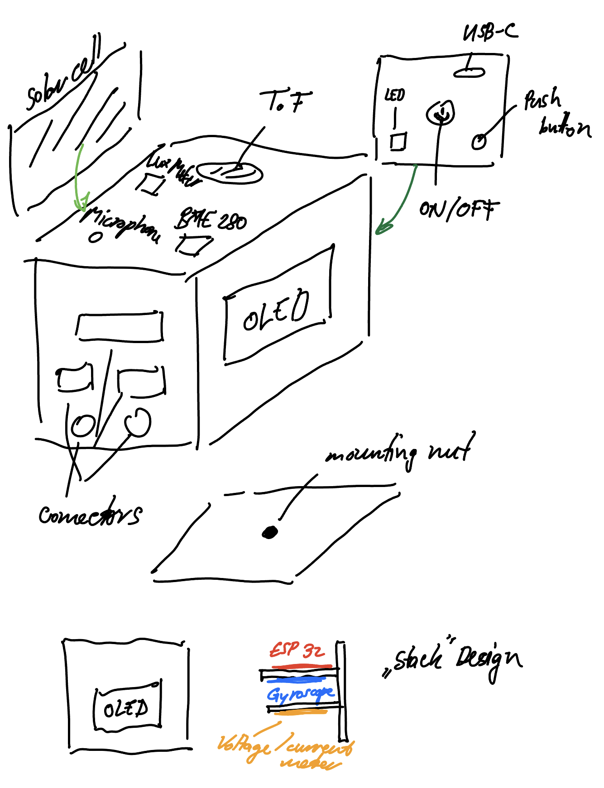

# Physics Sensor Cube ESP32-Tux³

This is an idea I had for some time after playing around with the ESP32 together with sensors, micropython and Phyphox. I started designing a PCB by my own for an ESP32-C3 chip. I want it to be as small as possible and also solar powered. The cube should be energy ,self-sufficient' and used for teaching physics. 

The cube should have the following sensors:
- Temperature, pressure and humidity sensor &rarr; BME280
- Gyroscope for acceleration and orientation measurements &rarr; MPU9250
- Optical/Light sensor (measuring Lux) &rarr; VEML7700
- 2 connectors for temperature probes (DS18B20)
- Voltage and current meter &rarr; INA219
- Time of flight sensor for measuring distances &rarr; VL53L1X
- optional: magnetometer & microphone for sound measurements

In addition the cube should have:
- OLED Display for showing current measurement data/sensor
- RGB-LED (e.g. for showing battery status)
- Push button for changing the sensor/measurement
- Solar cell and LiPo battery
- Pin-header for connecting to cube to a breadboard and use the GPIO Pins
- Mounting nut for placing the cube on a tripod
- On/Off-Button
- optional: buzzer for sound output

I aim for a 35x35x35mm cube with 3D printed case. The case should be robust - so that it can fall from a building and be undamaged... Hope to be able to do this project. 

My inspiration come from the [ESP32-Picoclick-C3](https://github.com/makermoekoe/Picoclick-C3), [BQ25504 Solar Cell LiPo Charger](https://hackaday.io/project/158837-ultra-low-power-lipo-charger-via-energy-harvesting), [01Space-ESP32-C3](https://github.com/01Space/ESP32-C3-0.42LCD) and the [Wemos C3 Pico](https://www.wemos.cc/en/latest/c3/c3_pico.html).

## Proof of concept

On the weekend of 22.4./23.4. I created my first prototype for the cube interior and the 3D printed case. 

 

## PCB design

## Case and schematics

## Software

### Micropython
### Phyphox
